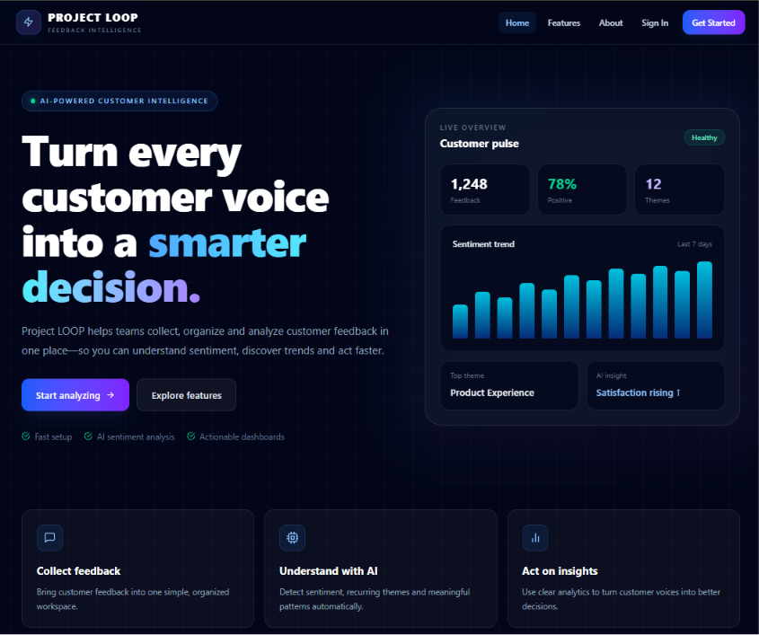

# 🔁 LOOP — AI Customer Feedback Intelligence Platform


A **production-style frontend** for **LOOP — AI Customer Feedback Intelligence Platform**.

LOOP is designed to help teams collect, organize, analyze, and understand customer feedback through a modern workspace that supports **feedback management, analytics, trends, AI-powered insights, reports, and role-based access**.

---

## 🚀 Features

* 🔐 **Authentication / Workspace Entry**
* 👥 **Role-Aware Workspace UI**

  * Admin
  * Analyst
  * Viewer
* 💬 **Feedback Ingestion & Inbox**
* 🔎 **Search, Filter & Status Workflow**
* 📊 **Dashboard Analytics**
* 🧩 **Theme Clustering**
* 📈 **Feedback Trends**
* 🤖 **Ask LOOP AI Interface**
* 📚 **Grounded AI Responses**
* 📝 **Voice-of-Customer Reports**
* 📱 **Responsive User Interface**
* ⚠️ **Empty, Loading & Error-Ready States**
* 🔌 **Backend API Integration Layer**
* 🧪 **Seed-Style Frontend Data for Development**

---

## 🖼️ Project Preview

Add your project screenshots inside the repository and use:

```markdown

```

You can also create a screenshots folder:

```text
screenshots/
├── dashboard.png
├── inbox.png
├── trends.png
├── ask-loop.png
└── reports.png
```

Then use:

```markdown


```

---

## 🧠 What is LOOP?

**LOOP** is a customer feedback intelligence platform designed to transform customer feedback into useful business insights.

The frontend provides dedicated interfaces for:

* Managing feedback
* Monitoring analytics
* Finding customer sentiment patterns
* Discovering recurring themes
* Tracking trends
* Asking AI questions about customer feedback
* Generating Voice-of-Customer reports
* Managing workspace users and roles

The frontend is designed so that it can later connect to a complete backend without requiring major UI changes.

---

## 🛠️ Tech Stack

### 💻 Frontend

* HTML5
* CSS3
* JavaScript
* Browser Local Storage
* Responsive Web Design

### 🔌 Backend Integration

The frontend includes a centralized API integration layer through:

```text
assets/api.js
```

The expected backend architecture can use:

* Node.js
* REST API
* PostgreSQL
* Prisma ORM
* Authentication
* Role-Based Authorization
* AI Integration
* Retrieval-based AI responses

---

## 📂 Project Structure

```text
LOOP-Frontend-Final/
│
├── index.html
├── README.md
│
├── assets/
│   ├── style.css
│   ├── app.js
│   ├── data.js
│   └── api.js
│
└── pages/
    ├── dashboard.html
    ├── inbox.html
    ├── trends.html
    ├── ask.html
    ├── reports.html
    └── settings.html
```

---

# ⚙️ Run the Project in VS Code

There are two simple ways to run the frontend locally.

---

## Option A — Live Server

### 1️⃣ Open the Project

Open:

```text
LOOP-Frontend-Final
```

in **Visual Studio Code**.

### 2️⃣ Install Live Server

Open the VS Code Extensions panel and search for:

```text
Live Server
```

Install it.

### 3️⃣ Start the Website

Right-click:

```text
index.html
```

Then select:

```text
Open with Live Server
```

The application will open automatically in your browser.

---

## Option B — Python Local Server

If Python is installed, open a terminal inside the project folder.

Run:

```bash
python -m http.server 5500
```

Then open:

```text
http://localhost:5500
```

in your browser.

---

# 🔌 Backend API Integration

LOOP includes a central API client:

```text
assets/api.js
```

This keeps backend communication in one place and makes future backend integration easier.

---

## Suggested API Routes

### 🔐 Authentication

```http
POST /api/auth/login
POST /api/auth/logout
GET  /api/me
```

---

### 💬 Feedback

```http
GET   /api/feedback
POST  /api/feedback
POST  /api/feedback/import
PATCH /api/feedback/:id
```

---

### 📊 Themes & Trends

```http
GET /api/themes
GET /api/themes/trends
```

---

### 🤖 Ask LOOP

```http
POST /api/insights/ask
```

---

### 📄 Reports

```http
POST /api/reports
GET  /api/reports
GET  /api/reports/:id
```

---

### 👥 Workspace

```http
GET   /api/workspace
GET   /api/workspace/members
POST  /api/workspace/members
PATCH /api/workspace/members/:id
```

---

# 🌐 API Base URL

The API URL can be configured from:

```text
Settings → API connection
```

or directly through browser local storage:

```js
localStorage.setItem(
  "LOOP_API_BASE_URL",
  "http://localhost:3000/api"
);
```

Example backend API:

```text
http://localhost:3000/api
```

---

# 🏗️ Recommended Architecture

The browser should communicate only with the application's own backend API.

Recommended flow:

```text
User
  ↓
LOOP Frontend
  ↓
Backend API
  ↓
Authentication & Authorization
  ↓
Workspace Validation
  ↓
Database / AI Services
  ↓
Clean JSON Response
  ↓
LOOP Frontend
```

---

## Backend Responsibilities

The backend should:

1. Authenticate the user.
2. Verify the user's role.
3. Scope every request to the authenticated `workspaceId`.
4. Communicate with PostgreSQL through Prisma.
5. Call the AI provider only from the server.
6. Perform retrieval before answering Ask LOOP questions.
7. Return clean JSON responses to the frontend.

---

# 🔐 Security

Never expose secrets inside frontend code.

Do **not** place values such as:

```text
ANTHROPIC_API_KEY
DATABASE_URL
JWT_SECRET
DATABASE_PASSWORD
AUTH_SECRET
```

inside:

```text
HTML
CSS
JavaScript frontend files
```

Sensitive credentials must always stay on the backend.

---

# 👥 User Roles

LOOP supports three workspace roles:

| Role           | Purpose                                   |
| -------------- | ----------------------------------------- |
| 👑 **Admin**   | Full workspace and user management        |
| 📊 **Analyst** | Feedback analysis, insights and reporting |
| 👁️ **Viewer** | Read-only or limited workspace access     |

> Frontend role-aware UI improves the experience, but real permissions must always be enforced by the backend.

---

# 💬 Feedback Inbox

The feedback workspace is designed to support:

* Customer feedback viewing
* Search
* Filtering
* Status management
* Feedback organization
* Pagination-ready workflows
* Feedback ingestion
* CSV import workflows

---

# 📊 Dashboard Analytics

The dashboard can surface high-level feedback intelligence such as:

* Total feedback
* Feedback volume
* Sentiment distribution
* Recent activity
* Theme performance
* Customer experience trends
* Key business insights

---

# 🧩 Themes & Trends

LOOP provides interfaces for identifying recurring themes inside customer feedback.

Examples may include:

```text
Product Quality
Customer Support
Pricing
Delivery
Performance
User Experience
Feature Requests
```

Theme trends help teams understand which topics are becoming more or less important over time.

---

# 🤖 Ask LOOP

**Ask LOOP** provides an AI-powered question-and-answer interface for customer feedback intelligence.

Example questions:

```text
What are customers complaining about the most?
```

```text
What are the biggest product issues this month?
```

```text
Which feedback themes are increasing?
```

```text
What do customers like most about the product?
```

```text
Summarize the top customer concerns.
```

For production use, Ask LOOP should use **grounded retrieval** so answers are based on real feedback records rather than unsupported AI responses.

---

# 📄 Voice-of-Customer Reports

LOOP includes a reporting interface designed for creating **Voice-of-Customer (VoC)** reports.

Reports can summarize:

* Customer sentiment
* Top themes
* Key complaints
* Positive feedback
* Emerging trends
* Important customer requests
* Recommended actions

---

# 🗃️ Development Data

The file:

```text
assets/data.js
```

contains a small **seed-style frontend dataset**.

It exists so that the UI remains populated while backend development is still in progress.

It is **not intended to replace the production database**.

When backend integration is complete, page-level:

```js
LOOP_DATA
```

reads should be replaced with API calls.

The user interface can remain unchanged.

---

# 🌿 Git Workflow

Create a frontend development branch:

```bash
git checkout -b feat/loop-frontend
```

Add all files:

```bash
git add .
```

Commit the changes:

```bash
git commit -m "feat: build LOOP customer intelligence frontend"
```

Push the branch:

```bash
git push -u origin feat/loop-frontend
```

Then create a **Pull Request** into your team's main branch.

---

# ✅ Before Final Submission

* [ ] Connect all backend API endpoints.
* [ ] Test login and logout.
* [ ] Test Admin permissions.
* [ ] Test Analyst permissions.
* [ ] Test Viewer permissions.
* [ ] Enforce permissions from the backend.
* [ ] Test feedback creation.
* [ ] Test feedback filtering.
* [ ] Test feedback status updates.
* [ ] Test CSV validation.
* [ ] Test feedback pagination.
* [ ] Test theme clustering.
* [ ] Test trend analytics.
* [ ] Test Ask LOOP.
* [ ] Verify Ask LOOP grounding.
* [ ] Verify AI source citations.
* [ ] Test Voice-of-Customer report generation.
* [ ] Test report export.
* [ ] Test loading states.
* [ ] Test empty states.
* [ ] Test error states.
* [ ] Run accessibility checks.
* [ ] Test mobile responsiveness.
* [ ] Test tablet responsiveness.
* [ ] Test desktop responsiveness.
* [ ] Remove unused development seed-data fallbacks.
* [ ] Deploy the frontend.
* [ ] Deploy the backend.
* [ ] Add project screenshots.
* [ ] Prepare the demo video.
* [ ] Complete final documentation.

---

# 👨‍💻 Team Members

LOOP was developed collaboratively by a team of **4 members**.

| #   | Team Member              | Role                    |
| --- | ------------------------ | ----------------------- |
| 1️⃣ | **Nitin**            | Developer / Team Member |
| 2️⃣ | **Ainul Haq** | Developer / Team Member |
| 3️⃣ | **[Team Member 3 Name]** | Developer / Team Member |
| 4️⃣ | **[Team Member 4 Name]** | Developer / Team Member |

---

## 🤝 Team Contribution

The team collaborated across:

* 🎨 UI/UX Development
* 💻 Frontend Development
* ⚙️ Backend Integration
* 🗃️ Database Development
* 🤖 AI Integration
* 🔐 Authentication & Authorization
* 📊 Analytics
* 🧪 Testing & Debugging
* 📚 Documentation

---

# 🚀 Future Improvements

Potential future enhancements include:

* Real-time feedback updates
* Advanced analytics
* More detailed sentiment analysis
* Automated theme discovery
* AI-generated executive summaries
* Exportable PDF reports
* Email report delivery
* Multi-workspace support
* Advanced user permissions
* Notification system
* Better accessibility
* Automated testing
* CI/CD integration
* Production monitoring

---

# ⭐ Support

If you find **LOOP** useful, consider giving the repository a ⭐.

Feedback, suggestions, and contributions are welcome.

---

### 💙 Built by Team LOOP

**Transforming Customer Feedback into Actionable Intelligence.**

🔁 **LOOP — Listen • Organize • Understand • Progress**
